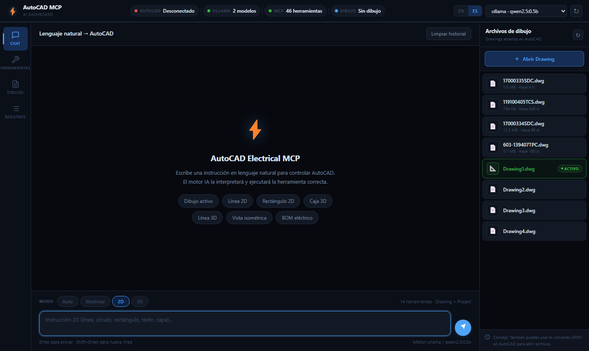
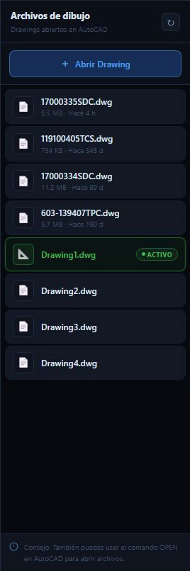
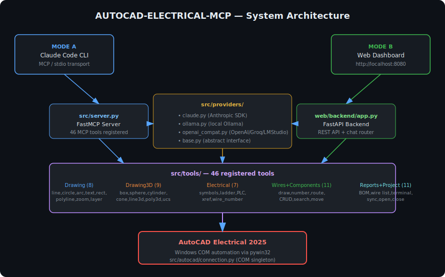

# AUTOCAD-ELECTRICAL-MCP

> MCP server + local AI web dashboard for **AutoCAD Electrical 2025** — control AutoCAD with plain language via Claude, Ollama, or any OpenAI-compatible model.

[](https://www.gnu.org/licenses/agpl-3.0)
[](https://www.python.org/downloads/)
[](https://www.autodesk.com/products/autocad/autocad-electrical)
[](https://ollama.com)

---

## Screenshots

| English UI | Spanish UI |
|:---:|:---:|
|  |  |

| Drawing Files Panel | Active Drawing Highlighted |
|:---:|:---:|
|  |  |

---

## Overview

**AUTOCAD-ELECTRICAL-MCP** bridges AI models and AutoCAD Electrical 2025. It exposes **46 AutoCAD operations** as [Model Context Protocol (MCP)](https://modelcontextprotocol.io) tools, enabling AI assistants to draw, annotate, wire, and generate reports directly inside AutoCAD — using natural language.




Two fully independent operation modes share the same tool core:

| Mode | Client | AI Engine | Requires |
|------|--------|-----------|----------|
| **Mode A — Claude Code** | Claude Code CLI | Claude API | Anthropic API key |
| **Mode B — Web Dashboard** | Browser `localhost:8080` | Ollama (local) | Ollama installed |

---

## Features

- **46 MCP tools** — 2D drawing, 3D modelling, electrical schematics, wires, components, reports, project management
- **Drawing modes** — Auto · Electrical · 2D · 3D — each exposes a focused tool subset to the AI
- **Compound drawings** — single prompt generates multi-step objects (3D screw, full electrical schematic with rails, cables, and symbols)
- **Keyword pre-router** — common phrases bypass the LLM entirely for instant, reliable execution
- **34 tool-name aliases** — corrects AI hallucinations transparently (`draw_cube` → `draw_box`)
- **Multi-provider AI** — Ollama, Claude, OpenAI, Groq, LM Studio
- **Smart fallback** — on timeout, queries installed models and retries with the smallest available
- **Local web dashboard** (FastAPI + vanilla JS) — works fully offline, no API key needed
- **COM automation** via pywin32 — direct, reliable connection to AutoCAD Electrical 2025
- **Zero-dependency frontend** — no Node.js, no npm, no build step
- **Bilingual UI** — English / Español, auto-detected from browser, instant switch, persisted in `localStorage`
- **PWA** — installable as a standalone desktop app (Chrome / Edge) with its own icon and taskbar entry
- **Drawing Files panel** — persistent right sidebar listing all open DWGs with file size, last-modified time, and active drawing highlighted in green
- **Service worker** — cache-versioned static assets, offline API fallback, cache-first with stale-while-revalidate

---

## Web Interface

The web dashboard is a FastAPI + vanilla JS single-page app served locally at `http://127.0.0.1:8080`.

### Running locally

```bash
# Start the web server (opens browser automatically)
python start_web.py

# Or specify host/port explicitly
python start_web.py --host 127.0.0.1 --port 8080 --no-browser
```

The dashboard has a **persistent three-column layout**: left sidebar navigation · main content · right Drawing Files panel.

#### Main panels (left sidebar)

| Panel | Description |
|-------|-------------|
| **Chat** | Natural-language instructions with drawing-mode selector (Auto / Electrical / 2D / 3D) |
| **Tools** | Searchable browser of all 46 tools grouped by category |
| **Drawings** | Open, list, activate, and track recently used DWG files |
| **Logs** | Real-time system log with level filter |

#### Drawing Files panel (always visible, right side)

The right panel is always visible alongside the main content. It shows all DWG files currently open in AutoCAD:

- File name, **file size**, and **time since last save** for each drawing
- The active drawing is highlighted with a green border and an **● ACTIVO / ● ACTIVE** badge
- Click any drawing to activate it instantly
- **+ Abrir Drawing / + Open Drawing** button opens the drawing form in the main panel
- Auto-refreshes every 15 seconds; click ↻ to refresh manually


---

## Drawing Selection

The **Drawings** panel lets you manage DWG files directly from the web interface.

### How it works

1. Click **Drawings** in the left sidebar
2. The panel fetches all drawings currently open in AutoCAD
3. The **active drawing** is highlighted in green — all AI instructions execute against it
4. To activate a different drawing, click **Activate** on any card in the list
5. To open a drawing from the project folder, click **+ Open Drawing** and type a sheet number or filename (e.g. `Sheet_03` or `Panel_Control.dwg`)
6. Recently activated drawings are stored locally and appear in the **Recent Drawings** section for quick access

### How activation works

Under the hood, "activate" calls `open_drawing(name)` which:
1. Searches for the drawing among AutoCAD's already-open documents — if found, sets it as `ActiveDocument`
2. If not found among open docs, scans the same directory as the current drawing for matching `.dwg` files and opens them

AutoCAD must be running with at least one drawing open for this to work.

---

## Language Support

The interface supports **English** and **Español**. Switch with the `EN` / `ES` toggle in the top-right corner.

### Behaviour

- Language is auto-detected from the browser on first load (`navigator.language`)
- Spanish is used if the browser reports `es-*`; English otherwise
- Manual selection is saved to `localStorage` and persists across sessions
- The switch is instant — no page reload required
- The AI assistant receives the selected language and responds in that language

### Adding a new language

1. Open [`web/frontend/js/i18n.js`](web/frontend/js/i18n.js)
2. Copy the `en` block and add a new key, e.g. `fr: { ... }`
3. Translate all string values (keep AutoCAD, DWG, MCP, Ollama untranslated)
4. Add a `<button class="lang-btn" data-lang="fr">FR</button>` inside `.lang-switcher` in `index.html`

No build step, no dependencies — just edit the JS object and add the button.

---

## PWA Support

The web interface is a full **Progressive Web App (PWA)**. You can install it as a standalone desktop application — no browser chrome, its own taskbar icon, launches like any native app.

### What's included

| File | Purpose |
|------|---------|
| `web/frontend/manifest.json` | App name, icons, colors, display mode |
| `web/frontend/sw.js` | Service worker — caches static assets, offline fallback |
| `web/frontend/icons/icon-192.png` | Standard icon 192×192 |
| `web/frontend/icons/icon-512.png` | Standard icon 512×512 |
| `web/frontend/icons/icon-512-maskable.png` | Maskable icon (safe-zone padding) |
| `web/frontend/icons/favicon.png` | Browser tab favicon 32×32 |

### Installing on Desktop (Chrome / Edge — Windows & Mac)

1. Start the web server: `python start_web.py`
2. Open `http://127.0.0.1:8080` in **Chrome** or **Edge**
3. An **"Install App"** button appears in the top-right corner of the dashboard
4. Click it — the browser shows the native install dialog
5. Click **Install** — the app opens as a standalone window with its own taskbar / Dock icon

> **Shortcut:** In Chrome/Edge you can also click the install icon (⊕) in the address bar, or go to `⋮ → Install AutoCAD MCP`.

After installation the app:
- Opens as a standalone window (no browser address bar)
- Appears in the Windows Start Menu / taskbar with its own icon
- Loads static assets from cache when the server is not yet running
- Automatically reconnects to the backend when the server starts

### Regenerating icons

Icons are generated by a pure-Python script — no external dependencies:

```bash
python scripts/generate_icons.py
```

---

## Tool Categories

| Category | Tools | Operations |
|----------|-------|------------|
| Drawing (2D) | 8 | Lines, circles, arcs, text, rectangles, polylines, layers, zoom |
| Drawing (3D) | 9 | Box, sphere, cylinder, cone, torus, extrude, revolve, 3D line, UCS/view |
| Electrical | 7 | Symbols, ladders, PLC modules, cross-references, wire numbers |
| Wires | 5 | Wire draw, numbering, routing, attributes, from-to |
| Components | 6 | CRUD, search, move, bulk update |
| Reports | 5 | BOM, wire list, terminal plan, PLC I/O list, project summary |
| Project | 6 | Drawing open/close, list, sync, project info |
| **Total** | **46** | |

### Drawing Modes

The web UI exposes four modes that control which tool subset the AI sees:

| Mode | Tools visible | Use when |
|------|--------------|----------|
| `auto` | 46 (all) | Unsure, or mixing 2D/3D/electrical |
| `electrical` | 46 (all) | Electrical schematics, ladders, symbols |
| `2d` | 14 (Drawing + Project) | Flat drawings, annotations |
| `3d` | 23 (Drawing + Drawing3D + Project) | Solid models, perspectives |

### Compound Drawings

Single prompts that trigger multi-step execution plans:

| Phrase | Steps | Result |
|--------|-------|--------|
| `"dibuja un tornillo 3D"` / `"draw a 3D screw"` | 5 | Cylinder shaft + cone tip + cylinder head, SE isometric view |
| `"esquema eléctrico"` / `"electrical schematic"` | 31 | L1/L2 rails, cable rungs, NO contacts, motor circle, labels, title block |

---

## Architecture

```
┌────────────────────────────────────────────────────────────────┐
│  MODE A                             MODE B                      │
│  Claude Code CLI                    Browser (localhost:8080)    │
│        │                                   │                   │
│        │ MCP / stdio                        │ HTTP / REST      │
│        ▼                                   ▼                   │
│  src/server.py (FastMCP)       web/backend/app.py (FastAPI)    │
│        │                                   │                   │
│        └──────────────┬────────────────────┘                   │
│                       ▼                                         │
│            web/backend/chat.py                                  │
│            ├── Keyword pre-router (34 aliases)                  │
│            ├── Compound drawing planner                         │
│            └── LLM orchestrator (mode-aware prompts)           │
│                       │                                         │
│              src/tools/ (46 tools)                              │
│              ├── drawing.py     (8)                             │
│              ├── drawing3d.py   (9)                             │
│              ├── electrical.py  (7)                             │
│              ├── wires.py       (5)                             │
│              ├── components.py  (6)                             │
│              ├── reports.py     (5)                             │
│              └── project.py     (6)                             │
│                       │                                         │
│         src/providers/ ← AI routing (Ollama, Claude, OpenAI)   │
│                       │                                         │
│         src/autocad/connection.py  (COM singleton)             │
│                       │                                         │
│              AutoCAD Electrical 2025                            │
└────────────────────────────────────────────────────────────────┘
```

---

## Requirements

- **Windows 10/11 (64-bit)** — COM automation is Windows-only
- **Python 3.11+**
- **AutoCAD Electrical 2025** running with an open drawing
- Mode A only: Anthropic API key
- Mode B only: [Ollama](https://ollama.com) installed and running

---

## Installation

```bash
# 1. Clone
git clone https://github.com/Igualguana/AUTOCAD-ELECTRICAL-MCP.git
cd AUTOCAD-ELECTRICAL-MCP

# 2. Install dependencies
pip install -e .

# 3. Configure environment
cp .env.example .env
# Edit .env — add your ANTHROPIC_API_KEY if using Mode A
```

### Ollama setup (Mode B — local AI)

```bash
# Install from https://ollama.com then:
ollama serve                   # start the server
ollama pull qwen2.5:0.5b       # fast, runs on 4 GB RAM
# or
ollama pull qwen2.5:7b         # better quality, needs ~6 GB RAM
```

> **Recommended**: `qwen2.5:0.5b` (397 MB) works well for the keyword pre-router and is reliable on machines with limited RAM. For the full LLM path use `qwen2.5:7b` or larger.

---

## Usage

### Mode A — Claude Code (MCP)

1. Open AutoCAD Electrical 2025 with a drawing
2. Copy `mcp_config.json`, set `"cwd"` to your project folder, then register:

```bash
claude mcp add-from-config mcp_config.json
```

3. Give natural-language instructions in Claude Code:

```
Draw a line from 0,0 to 200,100 on layer WIRES
Insert a normally-open contact WD_NOPEN at 50,150
List all components in the drawing
Generate the project BOM as CSV
```

Manual server start (for testing):
```bash
python -m src.server
```

### Mode B — Web Dashboard (Ollama)

1. Open AutoCAD Electrical 2025 with a drawing
2. Start Ollama: `ollama serve`
3. Launch the web interface:

```bash
# Windows one-click
start_web.bat

# or Python
python start_web.py
```

4. Open `http://127.0.0.1:8080`
5. Choose a drawing mode (2D / 3D / Electrical / Auto) and type an instruction

**Example prompts:**

```
dibuja una línea de 0,0 a 100,50          → draw_line
crea una caja 3D de 80×80×80              → draw_box
dibuja un tornillo 3D                      → 5-step compound (screw)
esquema eléctrico                          → 31-step compound (schematic)
cambia a vista isométrica SE               → zoom_3d_view SE_ISOMETRIC
genera el BOM del proyecto                 → generate_bom
```

---

## Configuration

Edit `config.yaml`:

```yaml
active_provider: ollama        # ollama | claude | openai | groq | lmstudio

providers:
  ollama:
    base_url: http://localhost:11434
    model: qwen2.5:0.5b        # change to any installed model
    timeout: 30
  claude:
    api_key: ${ANTHROPIC_API_KEY}
    model: claude-sonnet-4-6
  openai:
    api_key: ${OPENAI_API_KEY}
    model: gpt-4o-mini
```

Switch provider from CLI:
```bash
python scripts/switch_model.py -p ollama -m qwen2.5:7b
python scripts/switch_model.py --status
```

---

## Project Structure

```
AUTOCAD-ELECTRICAL-MCP/
├── src/
│   ├── server.py              # MCP server (FastMCP, stdio, 46 tools)
│   ├── config.py              # YAML + .env config loader
│   ├── autocad/
│   │   ├── connection.py      # COM singleton with retry logic
│   │   ├── detector.py        # AutoCAD variant detection (2023/2025/Electrical)
│   │   └── utils.py           # Geometry, layer, attribute helpers
│   ├── providers/
│   │   ├── base.py            # Abstract BaseProvider interface
│   │   ├── claude.py          # Anthropic SDK adapter
│   │   ├── ollama.py          # Ollama HTTP adapter + model library
│   │   └── openai_compat.py   # OpenAI / Groq / LM Studio adapter
│   └── tools/
│       ├── drawing.py         # 8 2D drawing tools
│       ├── drawing3d.py       # 9 3D solid tools
│       ├── electrical.py      # 7 electrical tools
│       ├── wires.py           # 5 wire tools
│       ├── components.py      # 6 component tools
│       ├── reports.py         # 5 report tools
│       └── project.py         # 6 project tools
├── web/
│   ├── backend/
│   │   ├── app.py             # FastAPI — REST endpoints
│   │   ├── chat.py            # Keyword router + compound planner + LLM dispatch
│   │   └── state.py           # Log buffer and chat history
│   └── frontend/
│       ├── index.html         # Single-page dashboard (3-column layout)
│       ├── manifest.json      # PWA manifest — name, icons, display mode
│       ├── sw.js              # Service worker — cache-versioned static assets
│       ├── css/style.css      # Dark premium theme + right panel styles
│       ├── icons/             # PWA icons (192×192, 512×512, maskable, favicon)
│       └── js/
│           ├── api.js         # Backend API client
│           ├── i18n.js        # Internationalisation engine (EN / ES)
│           └── main.js        # UI state, drawing panel, right panel, mode selector
├── docs/
│   └── images/
│       ├── architecture.svg        # System architecture diagram
│       ├── dashboard-overview.svg  # Web dashboard UI mockup
│       ├── tools-panel.svg         # Tools panel with all 46 tools
│       ├── dashboard-main.png      # Screenshot — main dashboard
│       ├── right-panel-drawings.png# Screenshot — Drawing Files panel
│       ├── drawing-active.png      # Screenshot — active drawing highlighted
│       ├── ui-english.png          # Screenshot — English interface
│       └── ui-spanish.png          # Screenshot — Spanish interface
├── scripts/
│   ├── install.py             # Automated setup
│   ├── generate_icons.py      # Pure-Python PWA icon generator (no Pillow)
│   ├── test_connection.py     # AutoCAD COM diagnostic
│   ├── switch_model.py        # CLI provider/model switcher
│   └── ollama_manager.py      # Ollama model library manager
├── tests/
│   └── test_tools.py          # Unit + integration tests
├── config.yaml                # Main configuration
├── mcp_config.json            # MCP registration template (edit cwd)
├── .env.example               # Environment variable template
├── start_web.py               # Web interface launcher
├── start_web.bat              # Windows one-click launcher
└── pyproject.toml             # Package metadata and dependencies
```

---

## Running Tests

```bash
# Unit tests (no AutoCAD required)
python -m pytest tests/ -v -m "not integration"

# Integration tests (AutoCAD Electrical 2025 must be running)
python -m pytest tests/ -v -m integration

# COM connection diagnostic
python scripts/test_connection.py
```

---

## Web API Reference

| Method | Endpoint | Description |
|--------|----------|-------------|
| GET | `/api/status` | AutoCAD, Ollama, MCP status |
| GET | `/api/tools` | All 46 tools grouped by category |
| POST | `/api/chat` | Natural-language → AI → AutoCAD |
| POST | `/api/execute` | Direct tool execution (no AI) |
| GET | `/api/providers` | Configured AI providers |
| POST | `/api/providers/switch` | Switch active provider |
| GET | `/api/logs` | System log entries |
| DELETE | `/api/logs` | Clear log buffer |
| GET | `/api/history` | Chat history |
| DELETE | `/api/history` | Clear chat history |
| GET | `/api/drawing/info` | Active drawing and project info |
| GET | `/api/drawings` | All open DWGs with `file_size` and `last_modified` |
| POST | `/api/drawings/open` | Open or activate a drawing by name / sheet number |
| GET | `/api/docs` | Interactive Swagger documentation |

---

## Validated Test Results

| Test | Prompt | Mode | Tool invoked | Result |
|------|--------|------|-------------|--------|
| T1 | `dibujame un cuadrado 3D` | 3d | `draw_box 100×100×100` | ✓ |
| T2 | `crea una caja de 80x80x80` | 3d | `draw_box 80×80×80` | ✓ |
| T3 | `dibuja una línea 3D de 0,0,0 a 100,100,100` | 3d | `draw_line_3d` | ✓ |
| T4 | `crea un rectángulo en 2D de 0,0 a 150,75` | 2d | `draw_rectangle` | ✓ |
| T5 | `cambia a vista isométrica SE` | 3d | `zoom_3d_view SE_ISOMETRIC` | ✓ |
| T6 | `dibuja un círculo radio 50` | 2d | `draw_circle r=50` | ✓ |
| T7 | `crea una esfera radio 30` | 3d | `draw_sphere r=30` | ✓ |

---

## Next Improvements / Roadmap

### Near-term
- [ ] **Undo/redo support** — `undo_last` tool via AutoCAD COM `Undo()` call
- [ ] **Layer panel in dashboard** — list, create, toggle visibility of layers
- [ ] **Direct tool execution panel** — run any tool directly from the UI without AI
- [ ] **Prompt history** — persist and recall previous instructions
- [ ] **Streaming responses** — show LLM thinking in real time via SSE

### macOS / cross-platform support (next major phase)

AutoCAD for Mac dropped COM automation, so a different bridge is required. Planned approach:

1. **AutoCAD Script/LISP bridge** — write `.scr` / `.lsp` files, inject via AutoCAD's `-script` CLI flag or `LISP` command (works on macOS)
2. **REST proxy on Windows** — for users with a Windows VM: run this server on Windows, expose a REST endpoint, connect from macOS
3. **DXF-based approach** — generate DXF files programmatically (using `ezdxf`) for platforms where COM is unavailable
4. **AutoCAD Web API** — use Autodesk Platform Services (APS/Forge) for cloud-based drawing manipulation

> Contributions to macOS support are especially welcome — see [CONTRIBUTING](#contributing).

### Long-term
- [ ] Plugin marketplace — install community tools without code changes
- [ ] Voice input via Whisper
- [ ] Drawing diff / version control integration
- [ ] Multi-drawing batch operations

---

## Contributing

Contributions are welcome under the terms of AGPL-3.0.

1. Fork the repository
2. Create a feature branch: `git checkout -b feature/your-feature`
3. Commit with clear messages
4. Open a pull request describing what you changed and why

Please ensure unit tests pass before submitting:
```bash
python -m pytest tests/ -v -m "not integration"
```

---

## License

This project is licensed under the **GNU Affero General Public License v3.0 (AGPL-3.0)**.

You are free to use, modify, and distribute this software. Any modified version run as a network service must make its full source code available to users of that service.

See the [LICENSE](LICENSE) file for the complete license text.

---

## Author

**Randy Igualguana**  
Copyright © 2026 Randy Igualguana

---

*Built with [Model Context Protocol](https://modelcontextprotocol.io) · [FastMCP](https://github.com/jlowin/fastmcp) · [FastAPI](https://fastapi.tiangolo.com) · [pywin32](https://github.com/mhammond/pywin32) · [Ollama](https://ollama.com)*
